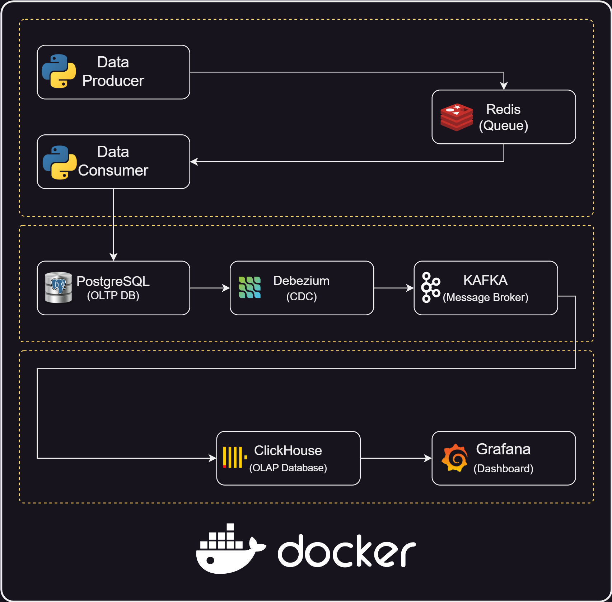

# DataEngineerGuys Workshop
## An Overview of Docker for Data Engineers
This repository hosts materials for the Docker for Data Engineers workshop, offering hands-on exercises and resources tailored for data engineering professionals.

- [Presentation Slides (download)](https://github.com/behnamyazdan/DockerForDataEngineers/blob/main/materials/DockerWorkshop_Presentation.pdf) 
---

## Overview of the Project


### 00- Docker Images
```bash
docker pull python:3.12-alpine && \
docker pull redis:7.2-alpine && \
docker pull postgres:13-alpine && \
docker pull debezium/zookeeper:2.5 && \
docker pull debezium/kafka:2.5 && \
docker pull provectuslabs/kafka-ui && \
docker pull debezium/connect:2.5 && \
docker pull debezium/debezium-ui:2.2 && \
docker pull clickhouse/clickhouse-server:23.8-alpine && \
docker pull apache/superset
```

### 01- Create Network
```bash
docker network create pipeline
```

### 02- Redis
```bash
docker run -d --rm --name redis --hostname redis --network pipeline -p 6379:6379 redis:7.2-alpine
```

### 03- Data Producer
```bash
docker build -t data_producer:0.0.1 src/data_generation/producer/
docker run -d --rm --network pipeline --name data_producer data_producer:0.0.1
```

### 04- PostgreSQL
```bash
docker run -d --rm --name postgres_alpine --hostname postgres_alpine --network pipeline -p 54321:5432 -e POSTGRES_PASSWORD=postgres -e POSTGRES_DB=ecommerce_docker postgres:13-alpine postgres -c wal_level=logical
```
(wal_level=logical --> all changes made to the database are written to the WAL in a format that can be read and applied to a replica)

### 05- Data Consumer
```bash
docker build -t data_consumer:0.0.1 src/data_generation/consumer/
docker run -d --rm --network pipeline --name data_consumer data_consumer:0.0.1
```

### 06- Zookeeper
```bash
docker run -d --rm --name zookeeper --hostname zookeeper --network pipeline -p 2181:2181 -p 2888:2888 -p 3888:3888 debezium/zookeeper:2.5
```

### 07- Kafka
```bash
docker run --name kafka --hostname kafka -p 9092:9092 --network pipeline --rm -d -e KAFKA_ADVERTISED_LISTENERS=PLAINTEXT://kafka:9092 -e KAFKA_LISTENERS=PLAINTEXT://kafka:9092 -e KAFKA_LISTENER_SECURITY_PROTOCOL_MAP=PLAINTEXT:PLAINTEXT -e KAFKA_INTER_BROKER_LISTENER_NAME=PLAINTEXT -e ZOOKEEPER_CONNECT=zookeeper:2181 -e KAFKA_OFFSETS_TOPIC_REPLICATION_FACTOR=1 -e KAFKA_TRANSACTION_STATE_LOG_REPLICATION_FACTOR=1 debezium/kafka:2.5
```

### 08- KafkaUI
```bash
docker run -d --rm --name kafka-ui --hostname kafka-ui --network pipeline -p 8080:8080 -e KAFKA_CLUSTERS_0_NAME=local -e KAFKA_CLUSTERS_0_BOOTSTRAPSERVERS=kafka:9092 provectuslabs/kafka-ui
```

### 09- Debezium Connecor
```bash
docker run -d --rm --name debezium --hostname debezium --network pipeline -p 8083:8083 -e GROUP_ID=1 -e CONFIG_STORAGE_TOPIC=connect_configs -e OFFSET_STORAGE_TOPIC=connect_offsets -e STATUS_STORAGE_TOPIC=connect_statuses -e BOOTSTRAP_SERVERS=kafka:9092 -e REST_HOST_NAME=debezium -e REST_PORT=8083 -e ADVERTISED_HOST_NAME=debezium -e ADVERTISED_PORT=8083 debezium/connect:2.5
```

### 10- Debezium UI
```bash
docker run -d --rm --name debezium-ui --hostname debezium-ui -p 8085:8080 --network pipeline -e KAFKA_CONNECT_URIS=http://debezium:8083 debezium/debezium-ui:2.2
```
And, then:
```bash
curl -i -X POST -H "Accept:application/json" -H "Content-Type:application/json" \
    http://localhost:8083/connectors/ -d @src/debezium/debezium_postgres_connector.json
```

### 11- ClickHouse
```bash
docker run -d --rm --name clickhouse_alpine --hostname clickhouse_alpine -p 8123:8123 -p 9000:9000 --network pipeline clickhouse/clickhouse-server:23.8-alpine
```
And then, run these [queries](./src/clickhouse/clickhouse_scripts.sql).

### 12- Superset
```bash
docker run -d --rm --name superset --hostname superset -p 8088:8088 --network pipeline -e SUPERSET_SECRET_KEY=$(openssl rand -base64 42) apache/superset
docker exec -it superset sh -c 'superset db upgrade && superset fab create-admin --username admin --firstname Superset --lastname Admin --email admin@example.com --password admin && superset init'
```